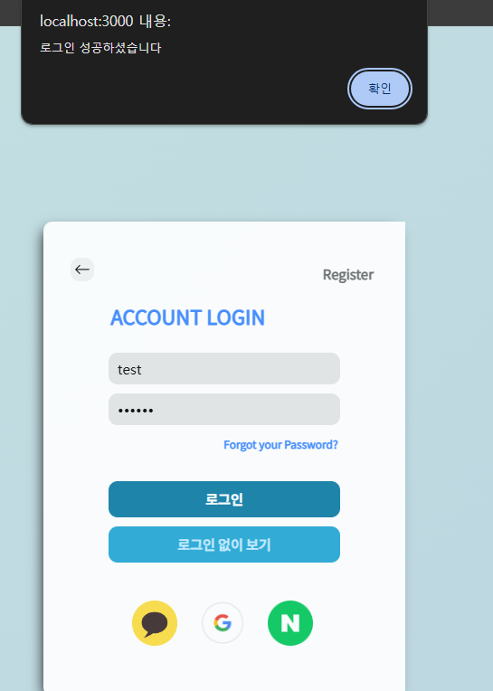
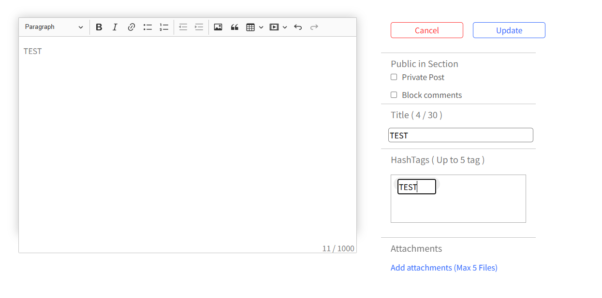
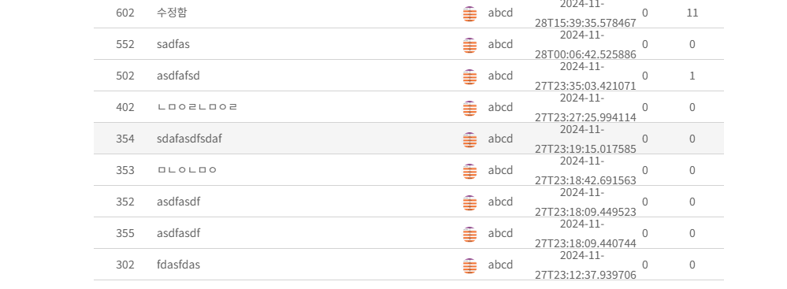

## YML 내용은 전부 지웠으므로 직접 작성하셔야합니다.

# 목차
1. [기술 스택 정리](#기술-스택-정리)
2. [버전 관리 및 빌드 도구](#버전-관리-및-빌드-도구)
3. [구현 기능](#구현-기능)
4. [회원가입 및 로그인](#회원가입-및-로그인)

## **기술 스택 정리**

#### **기본 프레임워크 및 라이브러리**
- **Spring Boot**: `3.3.5`
  - Spring Boot는 애플리케이션 개발을 위한 기본 프레임워크로, 빠른 설정과 구성이 가능하게 도와줍니다. `spring-boot-starter-parent`를 부모 POM으로 사용하고 있습니다.

#### **언어 및 버전**
- **Java**: `17`
  - Java 17은 LTS(Long-Term Support) 버전으로 안정적이고 최신 기능을 지원합니다.

#### **주요 라이브러리**
1. **Spring Boot Starter**
   - `spring-boot-starter`는 Spring Boot의 핵심 라이브러리로, 기본적인 애플리케이션 기능을 제공합니다.
   - `spring-boot-starter-data-jpa`: JPA (Java Persistence API) 기반의 데이터베이스 연동을 위한 라이브러리입니다.
   - `spring-boot-starter-mail`: 이메일 전송을 위한 라이브러리입니다.
   - `spring-boot-starter-security`: 애플리케이션에 보안 기능을 추가하는 라이브러리입니다.
   - `spring-boot-starter-validation`: Java Bean Validation을 사용하여 유효성 검사를 수행할 수 있는 라이브러리입니다.
   - `spring-boot-starter-web`: RESTful 웹 서비스 및 웹 애플리케이션 개발을 위한 라이브러리입니다.
   - `spring-boot-starter-websocket`: WebSocket을 사용하여 실시간 기능을 추가하는 라이브러리입니다.
   - `spring-boot-starter-data-redis`: Redis와의 연동을 위한 라이브러리입니다.

2. **JPA 및 데이터베이스**
   - **MySQL Connector**: `mysql-connector-j`는 MySQL 데이터베이스와 연결하기 위한 JDBC 드라이버입니다.
   - **QueryDSL**: `querydsl-jpa` 및 `querydsl-core`는 JPA를 보다 쉽게 다룰 수 있는 라이브러리입니다. 동적 쿼리 작성 시 유용합니다.

3. **보안**
   - **Spring Security**: `spring-boot-starter-security`는 애플리케이션에 인증 및 권한 부여를 추가하는 라이브러리입니다.
   - **JWT**: `jjwt-api`, `jjwt-impl`, `jjwt-jackson`은 JSON Web Token(JWT)을 사용하여 인증 및 인가를 처리하기 위한 라이브러리입니다.

4. **개발 도구**
   - **Spring Boot DevTools**: `spring-boot-devtools`는 개발 중에 자동으로 애플리케이션을 재시작하거나 빠른 디버깅을 지원하는 도구입니다.
   - **Lombok**: `lombok`은 Java 코드에서 보일러플레이트 코드를 줄여주는 라이브러리입니다. 예를 들어, getter, setter, equals, hashCode 등의 메서드를 자동으로 생성해줍니다.

5. **테스트**
   - **Spring Boot Test**: `spring-boot-starter-test`는 Spring Boot 애플리케이션을 테스트할 수 있는 라이브러리입니다.
   - **Spring Security Test**: `spring-security-test`는 Spring Security 관련 기능을 테스트할 수 있는 라이브러리입니다.

6. **클라우드 및 AWS 연동**
   - **Spring Cloud AWS**: `spring-cloud-starter-aws`는 AWS 서비스와의 연동을 위한 라이브러리입니다.

---

### **기술 스택 표**

| **기술**                   | **버전/라이브러리**                   |
|---------------------------|-----------------------------------|
| **Java**                   | 17                                 |
| **Spring Boot**            | 3.3.5                              |
| **Spring Boot Starter**    | - `spring-boot-starter`           |
| **JPA**                    | `spring-boot-starter-data-jpa`    |
| **Spring Security**        | `spring-boot-starter-security`    |
| **JWT**                    | `jjwt-api`, `jjwt-impl`, `jjwt-jackson` |
| **MySQL**                  | `mysql-connector-j`               |
| **Redis**                  | `spring-boot-starter-data-redis`  |
| **WebSocket**              | `spring-boot-starter-websocket`   |
| **QueryDSL**               | `querydsl-jpa`, `querydsl-core`   |
| **AWS**                    | `spring-cloud-starter-aws`        |
| **Validation**             | `spring-boot-starter-validation`  |
| **Testing**                | `spring-boot-starter-test`, `spring-security-test` |
| **Lombok**                 | `lombok`                          |
| **Development Tools**      | `spring-boot-devtools`            |

---

### **버전 관리 및 빌드 도구**
- **Maven**: 이 프로젝트는 Maven을 빌드 도구로 사용합니다. `spring-boot-maven-plugin`이 사용되어 Spring Boot 애플리케이션을 빌드하고 실행할 수 있습니다.

### **설명**
이 프로젝트는 Spring Boot를 기반으로 한 **백엔드 애플리케이션**으로, **JWT 인증**을 사용한 보안 기능, **JPA**를 통한 데이터베이스 연동, **WebSocket**을 통한 실시간 기능을 구현할 수 있는 구조로 설계되어 있습니다. 또한, **Redis**와 **AWS** 연동이 가능하며, **QueryDSL**을 통해 동적 쿼리 작성이 가능합니다.
   
   
## 구현 기능
1. 회원가입
2. 로그인
3. POST 작성
    3.1 게시글에 tag 추가
    3.2 게시글에 파일 업로드 및 다운로드
    3.3 게시글 like 및 조회수 확인
    3.4 게시글 수정 및 삭제가능
4. Comment 등록
    4.1 코멘트 수정 및 삭제가능
5. 검색기능
    5.1 특정 Tag 를 사용한 게시글 검색
    5.2 사용자가 작성한 POST 검색

## 회원가입 및 로그인
  
    - 등록한 Email 에 인증번호를 발송하여 인증을 합니다.   
    - Password 는 암호화 처리하여 데이터 베이스에 저장합니다    
    - 프로필사진은 S3 bucket을 통해 관리됩니다   
   
   
  
    - 인증메일을 전송하였습니다.        
    - 현재 사용하는 인증메일은 `3076` 입니다        
   
   
     
    - 인증번호는 `3076` 이지만 틀린 인증번호인 `0000`을 입력한 결과 회원가입이 정상적으로 되지 않습니다   
   
   
     
    - 올바른 인증번호 입력으로 회원가입이 완료되었습니다.   
   
   
     
  
   
---
## 게시글 작성 및 관리 기능   
   
### 1. 게시글 작성   
  
- 게시글 작성 시 입력 가능한 항목:   
  - 제목, 게시글 내용, 댓글 금지, private post, Tag, 첨부파일   
  - 첨부 파일은 **S3 버킷**을 통해 관리됩니다.   

### 2. 게시글 작성 완료
    
- 게시글 작성이 완료된 화면입니다.   
- 프로필 사진이 표시되지 않는 이유:   
  > 테스트를 진행하기 전에 **버킷을 초기화**했기 때문입니다.     
  > **초기화 이유**: POST에 업로드한 파일과 프로필 이미지 파일을 같은 디렉토리에서 관리하기 어려웠고, 디렉토리 구조를 다시 정리하기 위해 초기화를 진행했습니다.   
- **[버킷 재설정 완료](#버킷-재설정후-게시판-사진)**: 링크에서 재설정 이후 이미지가 정상적으로 표시되는 것을 확인할 수 있습니다.   

---
  
### 3. 댓글 기능
     
- 게시글의 댓글 등록 기능:   
  - 댓글 작성 시 **Post와 Comment 테이블의 양방향 관계**를 설정하여 구현하였습니다.   
  
---

### 4. 게시글 수정  
      
      
      
- 게시글 수정 기능 구현:   
  - 댓글 작성자의 이미지도 초기화 이후에는 정상적으로 출력되지 않았습니다.   
  
---

### 5. 게시글 검색   
#### 5.1 제목으로 검색   
      
- **게시글 제목**으로 특정 게시글을 검색할 수 있는 기능입니다.   

#### 5.2 태그로 검색   
      
- 특정 태그(**BBB**)를 가진 게시글 검색:     
  - 태그를 클릭하면 관련된 게시글을 검색합니다.   
  - **Tag 테이블**을 생성하고, **Many-to-Many 양방향 관계**를 설정하여 구현되었습니다.   
  
      
- 검색 결과: BBB 태그를 사용하는 모든 게시글이 리스트로 출력됩니다.   
  
      
- 검색된 게시글 중 하나의 내용을 확인한 결과, **BBB 태그**를 통해 정상적으로 검색되었음을 확인했습니다.   
  

## 버킷 재설정후 게시판 사진   
       
   